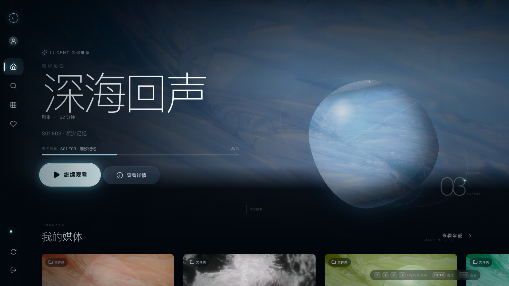
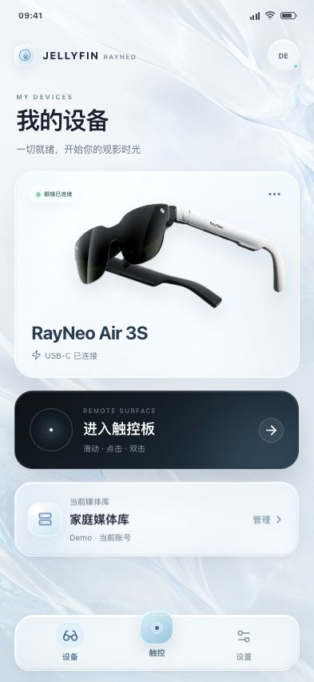

# Jellyfin for RayNeo Air

> 面向 RayNeo Air 系列眼镜的第三方 Jellyfin 客户端：手机负责连接与遥控，眼镜负责浏览与播放，一个应用提供 2D 镜像和 SBS 立体虚拟屏幕。

本项目不是 Jellyfin 或 RayNeo 的官方产品，与这些公司不存在隶属或背书关系。

[快速开始](#快速开始) · [核心能力](#核心能力) · [当前边界](#当前边界) · [文档](#文档)

<p align="center">
  
  
</p>

<p align="center"><sub>眼镜端媒体首页与手机伴侣端 · 截图使用演示数据</sub></p>

## 快速开始

你需要一台可访问的 Jellyfin 服务器、RayNeo Air 系列眼镜及配套 Android 手机。源码构建还需要 JDK 17+、Node.js/npm，以及 Android SDK platform 35 和 build tools 34.0.0。

1. 从 [GitHub Releases](https://github.com/buggzd/JellyfinForRayneo/releases) 下载正式签名的 ARM64 APK；需要自行构建 Debug APK 时：

   ```bash
   git clone https://github.com/buggzd/JellyfinForRayneo.git
   cd JellyfinForRayneo
   ./scripts/build-android.sh debug
   ```

2. 将 APK 安装到配套手机：

   ```bash
   adb install -r /path/to/downloaded.apk
   ```

   自行构建时可将路径替换为 `AndroidApp/app/build/outputs/apk/debug/app-debug.apk`。没有 ADB 时，也可以把该 APK 发送到手机并通过文件管理器安装。

3. 接入眼镜并启动应用，在手机端选择 Jellyfin 服务器、完成登录，然后进入触控板控制眼镜界面。

首次构建会自动下载并校验 RayNeo SDK、安装两套前端依赖并完成测试。环境配置、侧载说明和常见问题见 [使用指南](docs/USER_GUIDE.md) 与 [开发和构建指南](docs/DEVELOPMENT.md)。

## 核心能力

- **手机连接，眼镜观看**：手机端完成局域网发现、手动连接、Quick Connect、密码登录、设置与触控遥控；眼镜端专注媒体浏览和播放。
- **覆盖常用 Jellyfin 浏览流程**：支持首页内容流、媒体库、搜索、筛选、文件夹与剧集浏览，以及电影、剧集、季和单集详情。
- **同步你的观看状态**：支持继续观看、下一集、收藏、看过状态和播放进度回传。
- **兼顾直放与兼容性**：优先使用 HTML 视频直放，不兼容时回退到 Jellyfin 的 H.264/AAC HLS；支持音轨、文字字幕和服务端烧录字幕。
- **两种眼镜显示方式**：可在 Mirror 2D 与 SBS 立体虚拟屏幕之间切换，并保持单路视频、声音和播放上报。
- **无需 ADB 也能排查问题**：手机端显示连接阶段和安全诊断，可分享经过脱敏的诊断报告。

## 工作方式

| 手机端 Companion | 眼镜端 Glasses |
| --- | --- |
| 发现服务器、登录、设置、诊断 | 浏览媒体库、查看详情、播放视频 |
| 触控板移动焦点、确认、返回 | 显示唯一空间焦点并接收遥控 |
| 选择 2D/3D 显示模式 | 输出 Mirror 2D 或 SBS 立体画面 |

应用运行时会话、显示模式和两端消息由原生 Android 层统一管理，具体设计见 [Android 架构说明](docs/ANDROID_ARCHITECTURE.md)。

## 当前边界

这是一个面向 RayNeo Air 配套设备侧载的可运行 MVP，目前请注意：

- GitHub Releases 仅提供 ARM64 Android 包，运行时需要 Android System WebView。
- `targetSdk 29` 是 RayNeo Air SDK 1.0.3 的兼容选择，不满足当前 Google Play 的上架要求。
- 尚未实现多服务器切换、离线下载和播放列表编辑。
- 不兼容的媒体依赖 Jellyfin 服务端转码，本项目不提供原生备用播放器。
- UDP 自动发现基于 IPv4；IPv6 服务器需要手动填写域名或规范的 IPv6 地址。

完整限制、IPv6 写法和故障处理见 [使用指南](docs/USER_GUIDE.md)。后续计划见 [功能路线图](docs/JELLYFIN_FEATURE_ROADMAP.md)。

## 文档

| 你想了解 | 文档 |
| --- | --- |
| 安装、首次连接、显示模式、诊断与常见问题 | [使用指南](docs/USER_GUIDE.md) |
| 环境准备、构建、签名、浏览器开发与测试 | [开发和构建指南](docs/DEVELOPMENT.md) |
| 版本号、Git 标签与自动发布 | [版本与发布规则](docs/VERSIONING.md) |
| 会话边界、WebView 桥、显示状态机与播放架构 | [Android 架构说明](docs/ANDROID_ARCHITECTURE.md) |
| 已有能力与后续功能优先级 | [功能路线图](docs/JELLYFIN_FEATURE_ROADMAP.md) |
| Jellyfin Web 的信息架构与交互采样 | [Jellyfin Web 复现规格](docs/Jellyfin-Web-Reproduction-Spec.md) |

## 贡献

欢迎提交 Issue 和 PR。开始修改前请阅读 [开发和构建指南](docs/DEVELOPMENT.md)；涉及会话、桥接、播放、诊断、遥控或显示模式时，还需要阅读 [Android 架构说明](docs/ANDROID_ARCHITECTURE.md)。

提交 PR 前至少运行：

```bash
./scripts/build-android.sh debug
```

请使用聚焦的 Conventional Commit，并避免提交凭据、局域网地址、SDK 二进制、APK、签名文件或本机路径。

## 许可证与第三方声明

本项目采用 [MIT License](LICENSE)，版权所有 © 2026 buggzd。

Jellyfin 名称和商标归其权利人所有；RayNeo Air SDK 及开发文档归其权利人所有，分发前请自行确认相关条款。依赖与许可证信息见 [THIRD_PARTY_NOTICES.md](THIRD_PARTY_NOTICES.md)。

[Jellyfin 文档](https://jellyfin.org/docs/) · [Jellyfin OpenAPI](https://api.jellyfin.org/) · [RayNeo Air 开发文档](https://rayneo.gitbook.io/rayneo-devdoc/)
