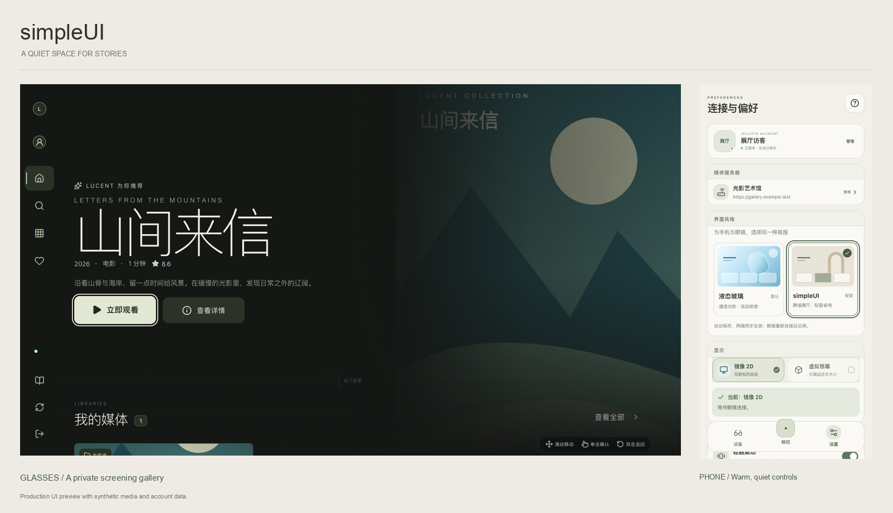
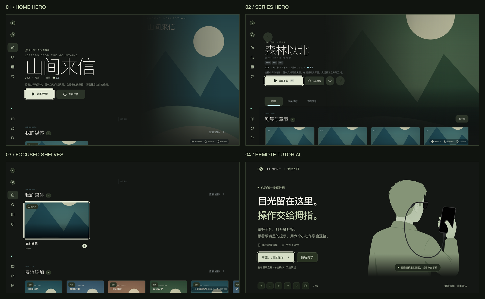

# 界面主题：liquid-glass 与 simpleUI

手机「设置 → 界面外观」提供两张可选择的预览卡。默认主题为液态玻璃
`liquid-glass`；`simpleUI` 使用相同的信息结构、导航和播放操作，以更轻量的
表面与动效呈现。选择会自动保存并同步到眼镜，重连、重启和退出账号后仍保留；
「恢复默认偏好」会恢复液态玻璃。

Liquid 手机端可在同一处选择或更换本机图片作为背景，也可恢复默认冰蓝背景。
图片只用于 Liquid 手机页面，触控板和 simpleUI 保持各自的背景；切回 Liquid
会恢复已选图片。设备卡不再叠加独立装饰图片，只保留液态玻璃、状态文字和官方
眼镜预览。设备、设置与账号管理卡片统一使用浅色玻璃填充和细边高光。
「玻璃透明度」统一调整这些卡片、内部选项与底部导航，0% 为实底，100% 最通透，
默认 88%；边缘高光保留，文字和图标本身不变淡。默认背景也可调整，滑动即时生效并保存。

选择图片后点击「调整背景」，可设置 0–100% 透明度、屏幕/9:16/3:4/1:1/原图
裁切比例、1–3 倍缩放，并拖动图片或用方向键、位置滑杆定位。「界面预览」显示
裁切结果铺满手机窗口后的效果；图片固定于窗口，长页面不会拉伸图片。透明度
越高，图片越淡，100% 时只显示浅色底；默认 65% 接近原先的柔和效果。
点击「应用背景」后保存，取消或返回保留上次调整。

「文字配色」默认自动，也可固定为浅色或深色。自动模式结合裁切、透明度与
文字当前所在的背景区域选择明暗，标题、透明卡片及页面分组分别判断，滚动后
重新匹配，也计算玻璃透明度以及嵌套卡片的叠加底色。设置卡片里的标题、说明、
版本号和透明操作同样适配；明暗混合区域增加细描边与柔和阴影，避免文字融入图片。
登录表单、主题/遥控器示意图与实心控件保留各自的固定配色。
只在选图时生成一份小尺寸内存采样，后续使用这份数据；静止页面不持续采样。

Liquid 底部导航跟随玻璃透明度，保留玻璃细边和当前页短横线。中间触控键使用
不透明冰蓝渐变与固定深色圆点，并置于底栏高光之上，下层边框不会穿过按钮。
自定义壁纸下，导航文字沿用自动/浅色/深色配色，自动模式也考虑滚到导航栏下方的
玻璃卡片。simpleUI 继续使用实色导航。



预览中的账号、服务器、海报与媒体名称均为合成演示数据。



## 设计

手机像一间温暖的展厅：暖白底色、石色拱形构图、细边框与灰绿色操作按钮。
眼镜像展厅中的放映空间：深炭灰背景、暖白文字、静止的主海报和清晰的细线焦点框。
海报、标题与留白构成主要层次，保留现有卡片、字号尺度与空间导航几何。
触控板默认纯黑，也可在设置中选择纹理背景；纯黑模式仅保留必要的操作提示。

| 设计要素 | 手机 | 眼镜 |
| --- | --- | --- |
| 基础背景 | `#f3f0e9` 暖白 | `#141714` 深炭灰 |
| 面板 | `#faf9f5` 实色 | `#232920` 实色 |
| 正文 | `#2e322d` | `#f0eee6` |
| 强调 | `#475d49` 灰绿 | `#d5ddc6` 浅苔色 |
| 交互 | 轻微按压、短距离淡入 | 小幅抬升、暖白焦点框、淡入淡出 |

## 渲染开销控制

- simpleUI 在两端统一禁用 `filter`、`backdrop-filter`、阴影、混合模式和常驻
  `will-change`；规则覆盖交互状态、浮层与伪元素。液态玻璃继续使用原有样式。
- 手机卸载环境背景和 SVG 折射定义，停止按钮光学跟随的指针处理及待执行的 rAF。
  冷启动 simpleUI 不预加载玻璃装饰图，设备卡仍保留产品图。系统栏和 WebView
  底色也随主题更新。
- 眼镜仅在首页与详情的 Hero 区域聚焦时显示静止海报，焦点进入内容行、剧集列表、
  详情标签等区域时卸载海报，显示纯色背景；其他浏览页面和登录/加载状态不挂载
  氛围背景。Hero 渐变跟随海报自身边缘，使用与页面相同的实色端点消除接缝。
- 遥控教学的人物和六种手势使用苔绿、暖灰配色的静态 SVG；颜色直接写入资源，
  无运行时滤镜，减少动态效果时也保持相同配色。成功反馈与六步教学逻辑保持一致。
  可运行 `python3 GlassesUI/scripts/prepare-tutorial-gestures.py --simple-ui-only` 从
  已提交的静态矢量重新生成 simpleUI 版本。
- 只为页面、操作和短暂反馈开启 `opacity` / `transform` 动画。常规过渡约
  140–240 ms；手势反馈在 520 ms 内结束。状态明确的加载图标可以旋转，静止页面
  不保留装饰性循环。尊重系统「减少动态效果」偏好。
- 主题不会降低视频刷新率、改变媒体解码或 HLS 参数，也不修改 SBS 的逐帧双眼合成。
  播放器保留单个视频和已有上报周期；字幕使用小面积深色底来保证亮画面上的可读性。

## 保存与同步

Android `SessionRepository` 的 `ui_theme` 是设备偏好的唯一持久化来源。
`selectUiTheme` 仅接收精确的 `liquid-glass` / `simpleUI`，其余输入直接忽略。
缺失或未知的已存值按液态玻璃恢复。原生通过两端现有的 `uiTheme` 状态字段同步，
手机等待原生状态回执后更新选中项；眼镜仅更新外观，不改变媒体库世代、播放器 key
或 WebView 实例。

`SharedUI/theme.mjs` 统一前端主题值，`SharedUI/simpleUI.css` 定义共同的效果限制与
动效白名单，两端各自的 `simpleUI.css` 定义色彩和组件外观。两套 Gradle 构建输入
都包含 `SharedUI`，修改共享主题后会重新生成 APK 内的前端资源。

独立浏览器预览和双端开发联调页可在 localStorage 中保存
`jellyfin-rayneo-preview-theme`，只包含主题名；原生运行不保存另一份主题偏好。
两个前端的开发服务器通常使用不同 origin，双端同步开发验证应使用 `DevHarness`。

手机背景独立于同步主题：Android 通过系统图片选择器读取单张 JPG/PNG/WebP，
限制原图 20 MiB、64 百万像素和单边 16000 像素，校正 EXIF 方向后缩小至最长
1600 像素，重新编码成不含原图元数据的 JPEG，原子替换私有文件。
取消或导入失败保留原图；退出账号、重启及 WebView 恢复后仍可使用。
裁切仅保存参数，不反复裁掉或重新压缩导入图片，可再次调整。Android 的
`companion_background_layout` 由 `SessionRepository` 保存，并只通过手机状态回执
更新界面，不刷新眼镜。更换图片会重置比例、缩放与位置，保留透明度。
文字配色同样跨重启保存并在换图时保留；旧裁切记录自动补上「自动」配色。
浏览器预览将自己的压缩图片与调整参数一起保存在 IndexedDB，兼容之前只保存
图片的记录；Android 不保存前端副本。「恢复默认背景」移除图片并重置裁切与
透明度，「恢复默认偏好」同时重置图片与其他偏好。

玻璃透明度独立保存在 `SessionRepository` 的 `companion_glass_transparency`，
仅接受 0–100 的整数，不要求先选择图片；桥接只允许从设置页修改，只发布手机状态。
浏览器预览使用自己的 `jellyfin-rayneo-preview-glass-transparency`。换图、清除背景、
切换主题和账号均保留此值，恢复默认偏好重置为 88%。触控板和眼镜不使用该参数。

## 遥控器背景

「设置 → 外观与交互 → 遥控器背景」提供「纹理」与「纯黑」两种选择，适用于
两种主题，与 Liquid 的自定义手机图片互相独立。没有手动选择时保留各主题默认：
Liquid 使用纹理，simpleUI 使用纯黑。手动选择后，切换主题、账号或重启仍保留；
恢复默认偏好会回到 Liquid 与纹理。

纯黑模式的页面底色、播放/搜索面板底色、WebView、窗口和系统栏背景均为
`#000000`，关闭纹理、噪点、持续微光、手指光晕、装饰环、阴影与背景渐变。
必要的文字、边框、进度和手势提示仍会显示，轻触震动沿用自己的开关。
Android 10+ 的系统栏对比度遮罩也会关闭，避免把黑底抬成深灰。
系统键盘、通知等系统界面仍由 Android 管理。

OLED 的零亮度黑色像素可以停止发光；截图中的 RGB 0,0,0 能确认软件输出，
不能代替光学测量，也不能保证所有厂商的屏幕处理行为。此选项不会关闭整块屏幕，
可见控件区域仍会发光。

## 验证与边界

2026-09-07 玻璃卡片统一与透明度调整：用混合明暗的本地壁纸检查了 320、360、393、
430 像素宽度、0/70/88/100% 玻璃透明度、展开设置与账号卡片、底栏叠加、刷新保存、
清除壁纸和恢复默认。simpleUI 保持实色且无背景滤镜；纯黑遥控器各背景层仍为
RGB 0,0,0。17 个手机前端测试、14 个联调测试、97 个 JVM 测试、TypeScript、两套
生产构建、lint 与 Debug/Release APK 校验通过。本次无已连接 Android 设备，新增
玻璃偏好的系统重建、实际播放中编辑与 RayNeo 真机回归仍需按架构矩阵执行。

真机数据见 [2026-09-06 性能报告](performance/2026-09-06/README.md)：已实测两套主题的
2D/Full-SBS 首页、导航、控件和实际 Jellyfin 播放开销，并补充暂停画面及系统帧轨迹对照。
报告对应被测版本 `a634122`；后续界面修正须另行真机回归。以下保留桌面验证记录。

2026-09-06 的验证使用生产构建、隔离 Chrome、合成媒体库与本地生成的 H.264/AAC
测试视频，未读取开发服务器凭据。

- 默认值、无效输入拒绝、原生偏好重建/退出账号后保留、恢复默认，以及 bootstrap
  去重与媒体库世代保持均有自动化覆盖。
- 手机设置在 320、360、393、430 像素宽度检查布局，主题卡不产生横向溢出。
  检查了手机首页/设置/触控板与眼镜首页/详情/搜索/媒体库/教学/播放画面。
- simpleUI 手机设置和眼镜首页的 DOM/伪元素计算样式检查中，滤镜数、阴影数与
  静止后的活动动画数均为 **0**；每次切换保留唯一眼镜焦点，没有新增媒体库请求。
- 在播放中连续切换四次主题，视频 DOM 对象与 `currentSrc` 保持相同，播放时间
  继续前进；没有新增播放计划请求或播放开始上报。覆盖减少动态效果与完整六步教学。
- Hero 修正覆盖 1440×810、1920×1080、1720×970、1440×1000 四种窗口尺寸，
  海报左边缘的像素采样与页面底色一致。首页内容行、详情标签、剧集卡片聚焦后
  海报节点卸载，返回 Hero 后恢复；在剧集区域切换主题不会重载媒体库或丢失焦点。
  教学欢迎页、六种手势、完成页及减少动态效果下的资源选择均完成浏览器验证，
  静态插画保持苔绿配色，未发现页面错误、滤镜、阴影或装饰性循环动画。
- 20 个眼镜前端测试、11 个开发联调测试、80 个 JVM 测试、TypeScript、两套生产构建、
  Debug lint、Debug APK 组装与 `verify-android.sh` 通过。

这些检查证明高开销装饰已从 simpleUI 的渲染路径移除，不能换算为真机节电百分比。
Hero 和教学配色修正的 Android/RayNeo 真机回归尚未执行；帧时间、GPU/内存/功耗、系统栏观感、
2D/SBS、重连和 renderer 恢复仍需按
[Android 真机回归矩阵](ANDROID_ARCHITECTURE.md#device-regression-matrix) 执行。
两种主题都保留正常播放和必要加载反馈的开销。

常规自动化入口：

```bash
./scripts/build-android.sh debug
node --test DevHarness/*.test.mjs
```
