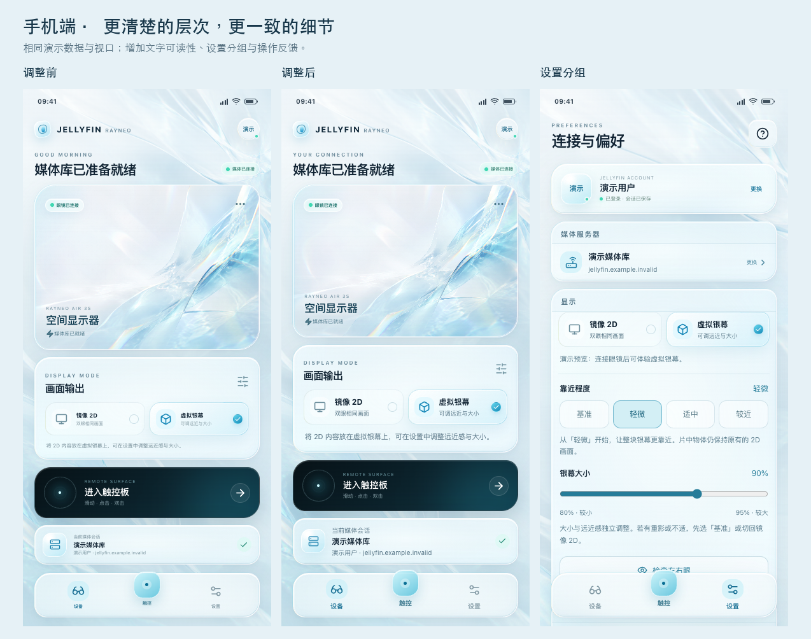
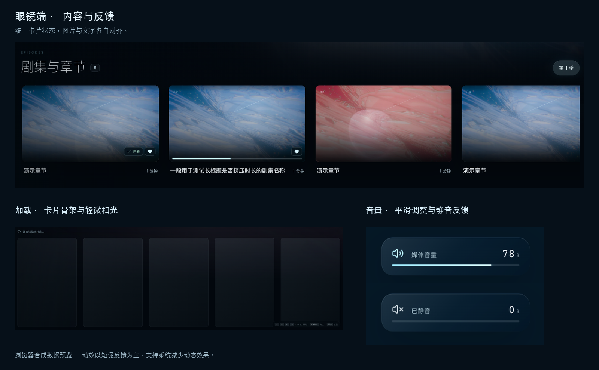
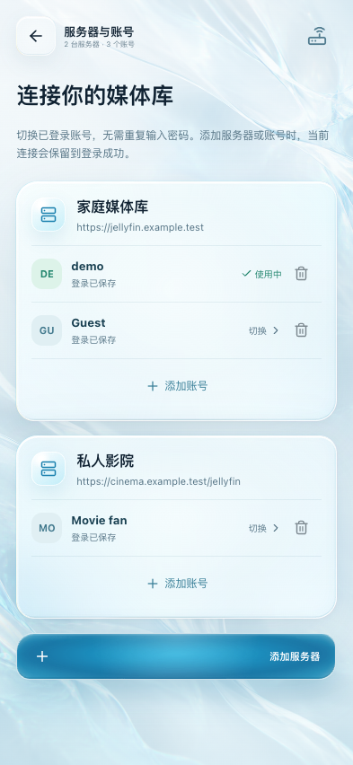
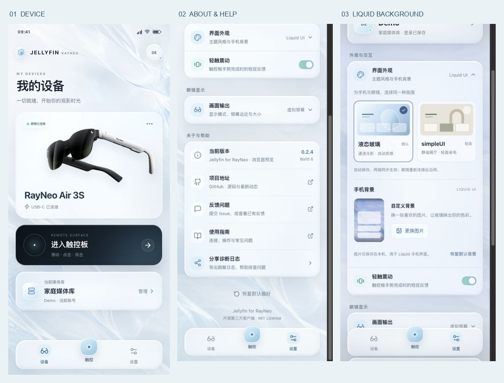
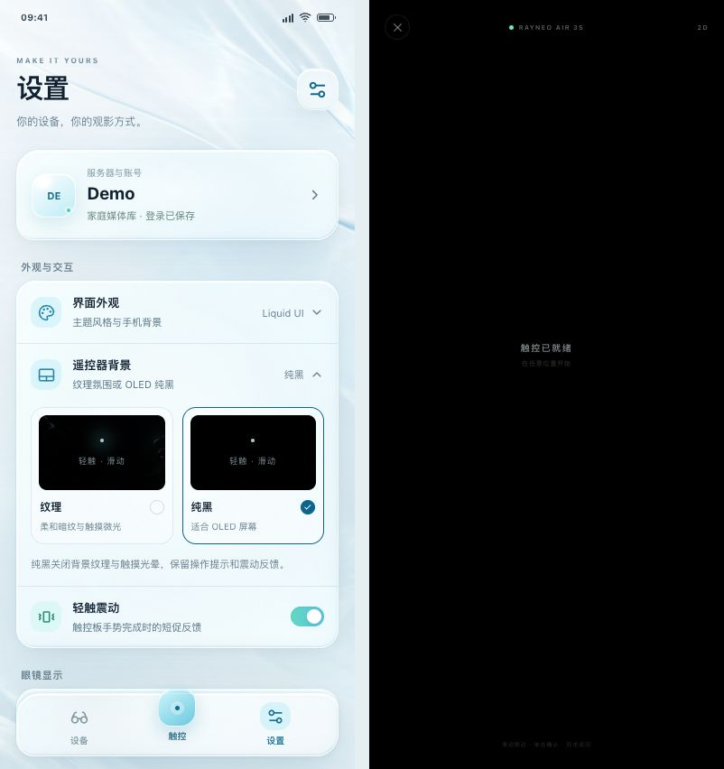

# UI 层次与交互细节审阅

日期：2026-09-06。基线：`6793fc5`；工作分支：`codex/ui-detail-polish`。

保留眼镜端的暗色影院感、手机端的冰蓝玻璃与黑色触控板。用一致的状态、明确的文字层级和短促反馈完善现有体验，减少与操作无关的大面积持续运动。此次没有增加动画依赖。

## 已处理的问题

| 原有细节 | 调整后的表现 |
| --- | --- |
| 媒体卡、剧集卡、搜索封面的观看与收藏状态不一致 | 共用状态标记；收藏、已看与续播进度使用同一位置、颜色和样式。已看内容不再同时展示未完成进度 |
| 进度条位置依赖卡片文字区的固定高度 | 进度条固定在图片底边；剧集播放图标以图片居中。长标题省略，不挤压右侧时长；移除重叠的装饰序号 |
| 背景图片加载失败时缺少明确的回退 | 封面使用延迟加载与异步解码，加载后淡入；失败保留本地艺术占位。真实封面不叠加重复的占位标题 |
| 首页内容行和详情分区的信息密度不一致 | 分区标题共用数量徽标；详情元数据只在两个有效字段之间显示分隔点 |
| 目录加载只显示一块空面板，失败可能被误认为没有内容 | 目录与剧集使用卡片骨架；目录失败给出固定文案和重试入口。返回上级后忽略旧请求，避免迟到内容覆盖当前页面 |
| 收藏为空、筛选无结果和服务器无内容共用提示 | 使用对应说明与有效下一步：浏览媒体库、清除条件或刷新 |
| 收藏和已看操作中缺少清楚的局部反馈 | 触发按钮显示加载图标并阻止重复请求，同时保留遥控焦点；成功后给出一次轻微图标反馈 |
| 所有通知都使用成功勾号，消失时突兀 | 成功、错误和说明有独立图标；通知淡入淡出。错误保留 4 秒，普通反馈保留 2.4 秒；旧内容留到淡出结束 |
| 音量提示只有入场动画，数字和进度变化生硬 | 固定宽度数字、较大的读数、静音／低音量／正常音量图标；进度以 transform 平滑更新，连续操作延长停留，退出中再次操作可恢复 |
| 页面和控制栏切换存在 650–900 毫秒动画 | 统一短时序，移除页面整体模糊和缩放；主详情页签、详细信息子页签、登录方式和立体设置使用相同入场节奏 |
| 手机部分说明只有 7–9 像素，设置标题与内容混在一起 | 增大模式、会话、导航和设置文字，分组标题增加淡色底与分隔线；统一页面边距与常用小按钮触控区域 |
| 小屏首页固定高度，长状态可能压缩内容 | 首页至少填满视口，内容较多时自然滚动；保留底部导航所需留白与滚动边距 |
| 手动地址弹层缺少完整键盘行为 | 弹层内循环焦点、支持 Enter 提交与 Escape／原生返回关闭；关闭后恢复入口焦点，离场弹层立即停止接收操作 |
| 存在没有执行任何操作的入口 | 移除详情的空“更多操作”按钮与无操作的微光说明行 |

## 动效约定

两端使用相同的基础参数：微交互 140 毫秒、入场 240 毫秒、离场 180 毫秒，缓动为 `cubic-bezier(.2, .8, .2, 1)`。底部弹层入场 280 毫秒；首页主视觉保留 380 毫秒的短入场。

新增反馈主要动画化透明度与 transform。音量不再动画化宽度；卡片骨架每组共用一条低亮度扫光，不给每张卡片添加独立动画。播放器加载提示延迟 160 毫秒出现，减少短暂缓冲的闪烁，播放请求和输入不会等待动画完成。静态艺术背景与玻璃层次保留，关闭大面积背景、光谱和装饰折射的无限运动。

`prefers-reduced-motion` 同时覆盖 CSS 时长、延迟和 JavaScript 滚动。开启后，操作结果、文字、静音标记和选中状态仍然可见。

## 验证与边界

使用合成媒体、合成账号、本地艺术图片与本地 H.264/AAC 样片进行浏览器验证，没有读取开发凭据或拍摄真实媒体库。

- 检查眼镜端首页、目录、详情、剧集、搜索与播放器，以及手机连接、密码登录、设置、地址弹层与原生状态模拟。
- 覆盖目录慢响应、失败重试、返回后迟到响应，封面成功与失败，长剧集标题、收藏提交期间的重复操作与错误通知。
- 直放与 HLS 两条路径分别确认：单个 `<video>`、开始与停止各上报一次，音量连续变化／静音／淡出中恢复，轨道面板关闭后焦点返回触发按钮。
- 眼镜端检查 1024×640、1440×810 与 1920×1080；手机检查 320×568、390×844 与 430×932。覆盖减少动态效果、唯一遥控焦点、页面横向边界，以及滚动到底部时会话卡与底部导航的间距。
- 模拟原生显示状态，检查切换中、失败后的显式重试、模式确认，以及立体设置回执。模拟不等于硬件验收。
- TypeScript、7 项前端测试、两端 production build、66 项 JVM 测试、Debug lint、APK 组装与 `verify-android.sh` 均通过。

当前没有连接 Android / RayNeo 测试设备。仍需按照 [Android 真机回归矩阵](ANDROID_ARCHITECTURE.md#device-regression-matrix) 验证实际 WebView、触控与系统键盘、显示连接、2D／SBS 切换、单音频／单上报及光学观感。本次未测量设备帧率、GPU 开销或功耗。

## 封面背景与播放提示修正

在同步本地 `main` 的 `527962a` 后，针对实际浏览反馈修正以下细节：

- 首页下方内容行与单集选择共用固定于视口的封面背景，轻微放大、模糊并降低亮度。移除详情页关闭背景的条件和单集局部背景，减轻叠加遮罩，让背景覆盖整个视野。回到季选择或详情操作时恢复剧集封面。
- 新封面加载完成后再以 240 毫秒淡入，期间保留上一张；忽略迟到的图片请求，失败时使用本地艺术背景。统一在父层控制透明度，避免交叠时短暂变亮。页面初始焦点不再覆盖用户已选中的卡片。
- 详情 Hero 封面移除棱镜与斜向光线装饰，保留封面本身和阅读渐变。
- 视频首帧就绪前显示当前单集缩略图的模糊背景与加载动画，遮住 WebView 默认播放占位。首帧就绪后背景淡出；播放中的短暂缓冲保留视频画面。图片缺失时使用暗色渐变，始终只有一个 `<video>`。
- 播放面板改用左右／上下滑动、单击与双击提示；音轨或字幕面板打开时，双击提示改为关闭选项。详情播放按钮、浏览页角落和搜索页也使用相同手势词汇。键盘开发操作保持兼容。
- 暂停后切换字幕或音轨，媒体就绪时结束加载提示并保持暂停；底部状态区正确区分加载、缓冲、播放和暂停。

使用合成封面、合成媒体库与本地样片验证：全局背景范围与焦点切换、图片迟到与失败、详情装饰移除、直放／HLS 请求和首帧分别延迟、播放中缓冲、失败重试、暂停后换字幕、唯一视频及播放开始／停止各一次上报、遥控快进十秒／暂停／返回与面板焦点恢复。1024×640、1440×810、1920×1080 下四组手势提示均保持可见；减少动态效果下背景与加载状态正常退场。

13 项前端测试、TypeScript 生产构建、两端资源构建、JVM 测试、Debug lint、APK 组装及 APK 边界检查通过。仍未连接 Android / RayNeo 设备，真实 WebView 占位、双眼可读性与 2D／SBS 回归需按上述矩阵验收。

## 手机设备页与多账号管理（2026-09-06）

分支：`codex/companion-ui-server-settings`。

- 设备页使用连续的纵向卡片布局，移除画面输出卡片，放大触控板入口；当前媒体库卡片可直接进入账号管理。
- 设备图采用用户提供的 RayNeo Air 3S 官网产品图，裁切主体、保留透明背景并压缩为本地 WebP；显示模式与银幕调整统一保留在设置页。
- 服务器与账号列表按服务器分组，支持同一服务器的多个账号、直接切换、添加以及确认后移除。进入管理、添加失败或取消均保留当前连接。
- 已保存的账号由 Android 管理；旧会话自动迁移，未保存账号仅在本次运行中可切换。移除或失效只影响对应账号，切换后清除旧的播放、搜索与浏览状态。

截图使用演示账号与保留的示例域名：

验证覆盖手机 360×640、360×800、393×852、430×932 的布局、断开与媒体库错误状态、滚动时底部导航避让，以及两台服务器／三个账号的切换、密码登录失败、Quick Connect 取消、手动地址、原生返回键和移除确认。77 项 JVM 测试、13 项眼镜端测试与 9 项联调服务／会话测试通过；两端 production build、Debug lint、APK 组装及源码／APK 边界检查通过。

当前无 Android / RayNeo 设备连接；上述浏览器桥模拟不替代真机回归，仍需执行架构文档中的设备矩阵。

## 控制栏排序与上滑导航

- 左侧五个位置固定为「上一集、后退十秒、播放／暂停、前进十秒、下一集」，右侧保留音轨与字幕。首尾集只禁用对应按钮，保留位置；方向导航跳过禁用项。长标题单行省略，不挤压按钮或顶部播放格式信息。
- 控制栏显示时，进度条上滑先收起界面；再次上滑只显示顶部信息并聚焦返回按钮，底部控制栏保持收起。下滑重新显示控制栏并聚焦进度条，再下滑进入播放按钮。
- 收起时清除按钮焦点，将输入留在视频区域，并禁用隐藏控件的交互。左右滑动仍可快退／快进十秒，单击播放／暂停并重新显示控制栏。自动隐藏也进入同一收起状态。
- 两次连续上滑按顺序处理；音轨／字幕面板优先处理自身导航，关闭后恢复触发按钮焦点。界面提示同步说明新的上滑路径。

浏览器使用合成媒体验证直放与 HLS、常规及连续手势、暂停／播放／自动隐藏、选项面板焦点恢复、加载期间的禁用焦点、上一集／下一集及首尾边界；三个预览尺寸和减少动态效果均覆盖。每次切集保留单个视频，各有一次开始与停止上报。两端构建、13 项前端测试、JVM 测试、Debug lint、APK 组装及 APK 边界检查通过；实际眼镜验收仍受上述设备边界限制。

## 常驻视频信息

参考 [Jellyfin Web playerstats](https://github.com/jellyfin/jellyfin-web/blob/master/src/components/playerstats/playerstats.js) 的播放信息和原始媒体分组，在控制栏右侧音轨、字幕之后增加视频信息开关。

- 单击开启右上角半透明面板，再次单击关闭。面板不接收遥控焦点，控制栏收起后仍保留；沿用短淡入淡出并遵守减少动态效果。小尺寸下收紧行间距，为顶部返回和底部控制栏留出空间。
- 当前播放展示视频编码与实际输出尺寸、帧率与标称码率、音频编码与字幕处理、连续缓冲时长、丢帧／总帧，以及解码选择和硬件能力。HLS 优先读取分片解析出的编码和当前档位，未提供的参数明确标示，不能拿源文件参数冒充转码后的结果。
- 原始媒体展示封装、文件大小、视频分辨率与编码、源帧率与码率、Profile／位深／动态范围、像素格式与色彩、所选音轨的声道／采样率／码率。转码请求的编码与已知原因单独标注；不显示文件路径、播放地址或认证参数。
- WebView 自动选择实际解码器，公开接口无法确认本次硬解或软解。面板显示「系统自动（WebView）」及硬件支持能力，并说明实际状态未公开；直放、服务器转码与客户端硬解是不同信息。
- 只在开启且页面可见时每秒采样，不增加服务器轮询。准备新流时清空旧参数，暂停换轨后保持暂停；切集保留开关，退出播放器或切换账号后清除。

合成媒体回归覆盖直放与 HLS 的原始／输出参数、开关与连续点击、控制栏收起／顶部返回／自动隐藏、关闭后停止采样、音轨面板焦点、暂停换轨、切集、退出重进、准备失败和直放失败后的 HLS 回退；确认单个视频且开关不增加播放准备或上报。1024×640、1440×810、1920×1080 下信息面板与控制栏保持间距，减少动态效果生效。TypeScript、19 项前端测试、77 项 JVM 测试、两端构建、Debug lint、APK 组装和源码／APK 边界检查通过。当前未连接 Android / RayNeo 设备，实际双眼可读性、WebView 统计支持和设备回归仍需真机验收。

## 手机设置与 Liquid 背景（2026-09-07）

- 设置页合并账号与服务器入口，按外观与交互、眼镜显示、关于与帮助分组；主题与显示控制按需展开，收起显示控制会结束左右眼检查。移除不可操作的「微光反馈」说明行。
- 关于区域显示真实安装包版本与构建号，提供 GitHub 项目、Issue 反馈、使用指南及脱敏诊断入口；公共链接在系统浏览器中打开。
- Liquid 设备卡移除独立背景图片和雾层，保留玻璃表面、状态文字与官方眼镜图，删除对应预加载与打包资源。
- Liquid 手机端支持选择、更换和重置本机背景；Android 使用系统选图、有限大小解码、EXIF 方向校正和原子保存。图片不进入账号、眼镜或诊断数据，simpleUI 与触控板不显示自定义背景。

预览使用演示账号和仓库自带图片。浏览器验证了 320、360、393、430 像素宽度，主题展开与显示展开、底部导航避让、导入和更换、损坏/超大图片保留原图、页面重新打开、主题切换、触控板排除、恢复背景及恢复全部偏好；收起显示控制会清除检查图状态。

20 项眼镜前端测试、13 项联调测试和 90 项 JVM 测试通过；新增固定链接白名单、背景资源路径、图片字节与像素边界，以及遥控器偏好持久化、输入校验和不刷新眼镜的检查。TypeScript、双端生产构建、Debug lint（零问题）、Debug/Release APK 组装和源码/APK 边界检查通过。

### 遥控器纹理 / 纯黑

两种主题都可以选择遥控器背景，选择会跨主题、账号及重启保存。纯黑模式移除
纹理、噪点、持续微光、手指光晕与装饰环，所有背景层输出 `#000000`，并禁用
Android 系统栏对比度遮罩。操作文字与控件仍会显示。

浏览器覆盖 320/360/393/430 像素宽度、两种主题、纹理与纯黑、重载和手势；
纯黑时背景图、噪点和光晕节点数为 0，所有祖先背景均为不透明 RGB 0,0,0；
恢复默认偏好回到 Liquid 与纹理，浏览器无警告或错误。
已安装并核对本次 Debug APK，在连接 RayNeo 的 2509FPN0BC 手机上通过真实
设置入口验证选择及状态回执；强制停止后冷启动保留纯黑选择和原有登录，眼镜
重新就绪。无损 `screencap` 的 1200×2608 图像中，稳定后
触控空白区域 `[80,300,1120,2480)` 的 **2,267,200** 个像素全为 RGB 0,0,0；
状态栏空白区域 `[400,0,600,110)` 和导航栏空白区域 `[0,2540,300,2608)` 同样为零。
Liquid 按住触控板时，避开正在消失的提示文字后，上方 884,000 个空白像素及
触点周围 50,000 个像素均为零，未出现手指光晕；返回设备页恢复正常浅色背景。
系统图标、导航手势条和厂商侧边栏仍是可见的系统控件。截图不包含光学测量，
无法据此量化 OLED 实际发光或功耗。

本次真机检查聚焦手机设置与遥控器；完整 Android/RayNeo 回归矩阵、系统选图
取消与 EXIF 实际显示、renderer 恢复及外部浏览器往返仍需后续验收。
