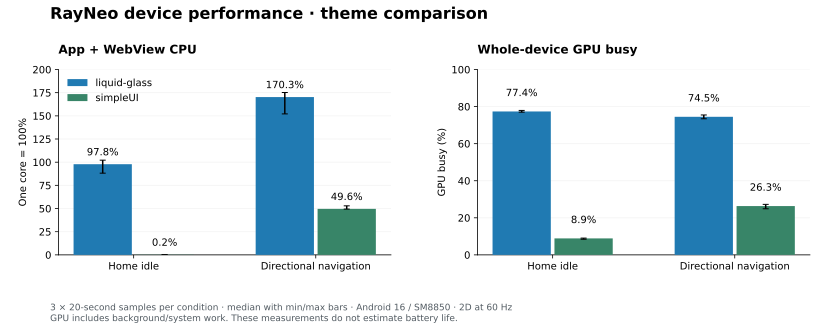
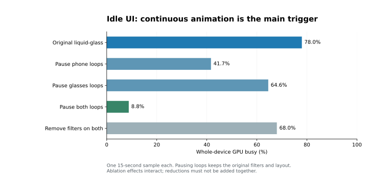
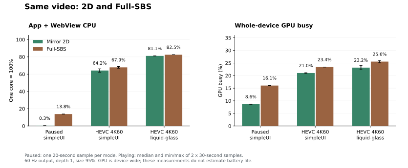

# 真机性能报告：UI、主题、解码与 SBS

> 历史实测：数值、验证范围和构建方式对应文中版本。已实施措施与后续工作见 [性能维护](../../PERFORMANCE.md) 和 [功能路线图](../../JELLYFIN_FEATURE_ROADMAP.md)，不要把本报告的建议直接当作当前待办。

测试日期：2026-09-06。源码：`a634122`；安装并测试 `0.2.4-debug`。

后续已实施保持视觉效果的优化，并以更新后的 main 重新对照；见 [2026-09-07 优化与复测](../2026-09-07/README.md)。本页保留原始测试结果。

**已完成真机 UI、两套主题、实际 Jellyfin 解码播放、Full-SBS 及 2D 对照。** 包含控件消融、系统帧轨迹和左右眼画面抽样；结果适用于本机和本次短片段，未测电池功耗或长时间热态。

## 结论

1. **当前首要性能开销是液态玻璃首页的持续动画与绘制。** 2D 双端首页静止时，应用及关联 WebView renderer 合计约占用一个 CPU 核；simpleUI 可以停止应用绘制。关闭循环动画、保留玻璃滤镜的消融实验也能接近空闲，支持优先把装饰动画改为短暂反馈。
2. **simpleUI 的导航开销显著更低。** 三轮中位数：应用 CPU 从 170.3% 降至 49.6%，约降低 70.9%；整机 GPU 忙碌率从 74.5% 降至 26.3%。这些是资源占用变化，不能换算为续航提升比例。
3. **H.264 / HEVC 视频硬解已经实际启用。** H.264 1080p25、4K25 和 AV1/MKV 经 HLS 回退后的 1080p24 采样均为零视频丢帧。授权后的 4K60 HEVC Main 10 对照中，2D 单次丢帧 0%–1.48%，SBS 1.48%–2.25%；缓冲充足且没有等待事件，需要继续定位输出与呈现调度。
4. **容器兼容性会带来显著服务端成本。** AV1/MKV 样本因容器不支持，触发 H.264/AAC 软件转码；应评估重封装或预先提供兼容容器，保留当前兼容回退。
5. **SBS 的主要问题是静态重绘和呈现排队。** 同一 4K60 视频的 SBS 播放整机 GPU 忙碌率比 2D 约高 2.4 个百分点；simpleUI 暂停后，SBS 仍消耗约 13.8% 单核 CPU，而 2D 约 0.35%。系统帧轨迹的平均帧开始到呈现时长为 SBS 38.7 ms、2D 6.9 ms；两者均接近 60 Hz 提交，不能把较高刷新频率等同低延迟。



## 环境和方法

| 项目 | 实际条件 |
| --- | --- |
| 手机 | 小米设备 `2509FPN0BC`；SoC `SM8850`；Android 16 / API 36 |
| WebView | `com.google.android.webview`，`150.0.7871.181` |
| 眼镜 | RayNeo / SmartGlasses；USB VID:PID `1bbb:af50` |
| 已确认输出 | Mirror 2D：1920×1080；Full-SBS：3840×1080；物理模式与 Presentation 一致，均为 60.000 Hz；眼镜 DOM 均为 1440×810 CSS 像素 |
| 应用 | 当前源码生成的 debug APK；两套生产 frontend bundle；原位安装保留登录 |
| Jellyfin | 实际已登录的本地服务，版本 `10.11.11`；读取 500 个实际媒体条目的技术元数据挑选样本 |
| 电源与温度 | 充电；有效采样电池温度 32.5–35.8°C，Android thermal status 为 0 |
| 运行方式 | ADB 无线连接；系统默认 DVFS、刷新率策略；未锁 CPU/GPU 频率 |

发现设备原有包虽然也标为 `0.2.4-debug`，但尚无主题桥方法，前端 bundle 与当前源码不同。因此先构建、原位更新，再开始正式采样。被测 APK SHA-256：

```
0df3690a26fea5a96e905adcceb7c804d9e6aed0ee47501785d5d93d8f8b40db
```

- 主题首页测试为 3 轮，每条件约 20 秒，顺序为 A/B、B/A、A/B。双端都在首页；先稳定页面，再采样。导航经原生桥每 400 ms 发一个方向命令，5 次向右、5 次向左循环，关闭触觉反馈。
- 控件消融单次约 15 秒，针对正在运行的循环动画或 CSS 滤镜临时干预，结束后恢复。设置页、触控板各 20 秒。
- 视频使用真实库内样本，播放稳定后定位到约第 60 秒，再预热 6 秒，正式记录约 30 秒。对比主题使用同一媒体、同一起始片段。不同编码样本的内容、码率、帧率不同，不能据此推导编码器之间的普遍能效差异。
- **CPU** 来自 `/proc/<pid>/stat` 的用户态与内核态 tick 增量，合计应用进程及其关联 WebView renderer。**100% 代表一个 CPU 核**，不含系统合成器和独立 codec 服务的 CPU。
- **GPU** 来自 KGSL `gpubusy` 的每秒采样，按忙碌时间/总时间加权；是整机 GPU 指标，包含系统和其他进程。静止 simpleUI 约 9% 的读数不能归因于应用。
- **内存**为应用与关联 renderer 的 PSS 之和，包括应用归属的图形内存；是采样结束的驻留状态，受图片、媒体缓冲与 GC 历史影响，不能当作固定最低内存或泄漏结论。
- 分阶段控制：早期干净的 HEVC/HLS 样本与隐藏动画消融在手机静态 USB 授权弹窗存在时采集。授权生效后，重新采集同一 HEVC 视频的 2D/SBS 两主题对照、HLS 对照和 SBS UI；主表 C 使用后者。未单独测量弹窗贡献，不能跨阶段把所有差异归因于模式或主题。
- 模式对照：先 2D 第 1 轮，再 SBS 第 1/2 轮，最后 2D 第 2 轮；每轮两主题交叉顺序，各 30 秒。SBS 与 2D 各另采一条约 20 秒 Perfetto 轨迹，以及 simpleUI 暂停画面 20 秒。SBS 首页两轮，每主题静止和导航各 20 秒；最后同一页面补一轮 2D。
- 视频计数来自 `getVideoPlaybackQuality()` 的增量；实际 codec 来自该应用 PID 的 `media.resource_manager`，并与 CDP Media 的平台视频解码状态交叉验证。未在静止页面安装持续 rAF 采样循环，避免测试器本身阻止页面休眠。

完整白名单数据见 [measurements.json](measurements.json)。原始系统轨迹、真实请求、媒体名称、账号和地址不纳入报告。

## 两套主题的实际开销

三轮中位数；括号中的范围是实测最小值–最大值，不是置信区间。

| 场景 | 主题 | 应用 CPU / % | 整机 GPU 忙碌率 / % | 合计 PSS / MiB |
| --- | --- | --- | --- | --- |
| 双端首页静止 | liquid-glass | 97.85 (88.14–102.21) | 77.36 (76.98–77.90) | 447.0 |
| 双端首页静止 | simpleUI | 0.24 (0.20–0.25) | 8.87 (8.44–9.04) | 386.0 |
| 首页方向导航 | liquid-glass | 170.30 (152.08–175.22) | 74.50 (73.44–75.47) | 472.7 |
| 首页方向导航 | simpleUI | 49.61 (49.40–52.88) | 26.34 (24.88–27.24) | 374.0 |

静止 simpleUI 三轮均为 **0 个应用 HWUI 绘制帧**，页面 JS 也基本空闲；这是预期的按需绘制行为。液态玻璃持续提交绘制。首页当前有 58 张媒体卡，液态玻璃眼镜 DOM 约 1,451 个节点；静态检查识别到眼镜 75 项、手机 26 项可见元素/伪元素的滤镜或阴影记录。simpleUI 的同类效果和稳定后的装饰循环均为 0。

两主题的 20 秒导航样本均未发现超过 50 ms 的页面 Long Task。辅助 HWUI P95 中位数为液态玻璃 32 ms、simpleUI 17 ms，但这一统计混合两扇应用窗口，不能用来声称眼镜运行于某个 FPS。

### 控件消融

以下保留液态玻璃主题和页面结构；每行只有一次 15 秒采样，用于定位触发点。

| 临时干预 | 应用 CPU / % | 整机 GPU / % |
| --- | --- | --- |
| 原样 | 99.4 | 78.0 |
| 仅暂停手机循环动画 | 54.5 | 41.7 |
| 仅暂停眼镜循环动画 | 52.0 | 64.6 |
| 暂停双端循环，保留滤镜/阴影 | 0.3 | 8.8 |
| 仅禁用手机 filter/backdrop-filter | 80.0 | 71.9 |
| 仅禁用眼镜 filter/backdrop-filter | 95.9 | 77.6 |
| 双端禁用 filter/backdrop-filter，保留动画 | 74.7 | 68.0 |



证据支持以下顺序：先处理持续失效和绘制，再评估滤镜成本。单独取消滤镜，GPU 仍约 68%；暂停双端循环后约 8.8%，即接近本机空闲背景水平。两端共享合成资源，消融收益有交互，不能把各行减少量相加。

| 控件/区域 | 观察 | 建议 |
| --- | --- | --- |
| 手机首页触控入口 | `surface-ripple` 常驻循环；暂停手机循环后整机 GPU 约 78.0%→41.7% | 页面进入或交互时短暂播放，静止后结束 |
| 眼镜连接状态光点、滚动提示 | `status-pulse`、`scroll-cue` 常驻循环；暂停眼镜循环后 GPU 约 78.0%→64.6% | 稳定连接使用静态状态点；滚动提示有限次播放 |
| 隐藏的播放器音柱 | 3 个 `sound-bar` 在控制栏隐藏后仍运行，动画修改 `height` | 隐藏后暂停；可见时优先用固定几何和 `scaleY`，验证外观 |
| 隐藏的手机触控说明 | 2 个 `intro-pulse` 在 `.touchpad-intro` 已不可见时仍运行 | 淡出完成后暂停或卸载装饰节点 |
| 玻璃面板与阴影 | 静态滤镜可与低空闲开销共存，但在每帧重绘时放大负担 | 保留效果做局部实验；避免直接全局降画质 |

最后两项隐藏动画的联合消融在 USB 授权前的 2D 阶段，使用同一 4K60 视频：液态玻璃应用 CPU 约 **81.4%→70.3%**，GPU 24.3%→24.1%；丢帧仍约 1.23%。这是一次定位实验，支持移除无可见收益的动画，但不支持把它当作 4K60 丢帧的完整修复。

手机停在设置页或触控板、眼镜仍在首页时：

| 手机页面 | 主题 | 应用 CPU / % | 整机 GPU / % |
| --- | --- | --- | --- |
| 设置页 | liquid-glass | 57.13 | 50.8 |
| 设置页 | simpleUI | 0.30 | 8.9 |
| 触控板 | liquid-glass | 59.52 | 51.1 |
| 触控板 | simpleUI | 0.20 | 8.9 |

该表是双端运行的合计，眼镜首页仍在消耗资源，不能将整行归为手机单个页面的成本。

### 帧统计的限制

本机 `gfxinfo` 的现代 jank、legacy jank 与 FrameTimeline 分类明显不一致；双窗口总帧数也不适合直接除以时间得到眼镜 FPS。0 帧时系统给出的 `4950 ms` 空直方图占位值已在数据中归一为 `null`。

辅助 Perfetto 轨迹中，32 MiB 环形缓冲只保留了末约 **9.08 秒**，因此只用这段分析：眼镜窗口有 540 个 surface frame，呈现间隔均值约 16.66 ms、P95 23.18 ms；应用 `RenderThread` 的在核运行时间约 3.88 秒，显示绘制线程是重要开销。该轨迹用于核验持续提交与线程热点，未将系统的 jank 分类换算为用户可感知卡顿率。采样器中的 `keyToRafMs` 仅供调度诊断，端到端触控延迟尚未测量。

## 解码、吞吐与播放效率

匿名样本来自实际 Jellyfin 库，均为 SDR。本轮不包含 HDR 输出验收。

| 样本 | 实际源 | 实际手机视频解码器 | 路径 |
| --- | --- | --- | --- |
| A | MP4，H.264 High，1920×1080，25 fps，8-bit，约 6.37 Mbps | `c2.qti.avc.decoder` | DirectPlay |
| B | MP4，H.264 High，3840×2160，25 fps，8-bit，约 20.48 Mbps | `c2.qti.avc.decoder` | DirectPlay |
| C | MP4，HEVC Main 10，3840×2160，60 fps，10-bit，约 4.39 Mbps | `c2.qti.hevc.decoder` | DirectPlay |
| D | MKV，AV1 Main，1920×1080，23.976 fps，10-bit，约 2.54 Mbps，带文字字幕 | `c2.qti.avc.decoder` | 服务端 H.264/AAC HLS 回退 |

CDP 同时报告 `MediaCodecVideoDecoder`、`kIsPlatformVideoDecoder=true`；AAC 音频为 `FFmpegAudioDecoder`。音频软解不代表视频软解。样本 D 没有测到 AV1 硬解，其实际手机输入是 H.264。

A/B/D 每行是一段稳定播放窗口；C 使用授权后两轮 2D 的 CPU/GPU/PSS 中位数和累计视频帧数。CPU/GPU 定义同上；“非丢弃帧/秒”由视频计数和媒体时间增量计算，描述 WebView 视频吞吐，不是眼镜光学实测 FPS。

| 样本 | 主题 | CPU / % | 整机 GPU / % | PSS / MiB | 丢弃帧/总帧 | 非丢弃帧/秒 |
| --- | --- | --- | --- | --- | --- | --- |
| A · H.264 1080p25 | simpleUI | 35.0 | 13.5 | 379.1 | 0/799 (0.00%) | 25.02 |
| A · H.264 1080p25 | liquid-glass | 49.6 | 16.5 | 420.3 | 0/757 (0.00%) | 25.01 |
| B · H.264 4K25 | simpleUI | 37.6 | 13.9 | 436.0 | 0/758 (0.00%) | 25.02 |
| C · HEVC 4K60 | simpleUI | 64.2 | 21.0 | 454.7 | 50/3643 (1.37%) | 59.18 |
| C · HEVC 4K60 | liquid-glass | 81.1 | 23.2 | 487.0 | 25/3645 (0.69%) | 59.59 |
| D · AV1 → HLS | simpleUI | 33.8 | 13.4 | 396.6 | 0/737 (0.00%) | 23.96 |
| D · AV1 → HLS | liquid-glass | 51.0 | 17.5 | 441.1 | 0/723 (0.00%) | 23.94 |

所有有效播放采样均没有 `waiting` 或 `stalled` 事件，结束时视频 readyState 为 4。A、B、D 的已测片段为零丢帧；这不能证明整片或所有码率都不丢帧。

**4K60 是需要继续优化的边界。** 授权后的两轮 2D 对照中，单次丢帧为 0%–1.48%；SBS 为 1.48%–2.25%。同一主题之间也有波动，且所有采样缓冲充足、无页面长任务，不支持用一段视频断言某主题能稳定满 60 fps。应结合 WebView/MediaCodec 输出队列与外屏呈现时序定位；CPU 占用较低也不能直接换算为硬件解码器功耗较低。较早、清理测试引用后的 0.93%/1.26% HEVC 样本留在原始白名单数据中作为辅助；未清理引用的 2.4%–2.7% 预备读数已剔除。

起播流程验证成功；测试器在控件就绪和轮询中存在额外等待，因此没有把起播读数作为可比较的性能基准。后续应连续测量从实际点击到首个可见视频帧的时间。

### HLS 的服务端与网络代价

Jellyfin 的设备会话中只有 1 个匹配会话，报告 `ContainerNotSupported`、`IsVideoDirect=false`、`IsAudioDirect=false`、`HardwareAccelerationType=none`。输出为 1920×1080 H.264/AAC、TS 分片，报告目标码率约 **9.68 Mbps**，相对约 2.54 Mbps 原片为 **3.81 倍**；服务端瞬时转码速度 **255 fps**，约为 23.976 fps 实时播放的 **10.6 倍**。

码率是服务端报告的输出目标，速度是一个时点的转码读数，均不是独立测得的网卡吞吐或整片平均。未测服务器 CPU 百分比与功耗。较高转码速度表明这一样本当时有吞吐余量，同时说明客户端硬解与服务端软件转码可以并存。

样本 D 使用文字字幕轨道，`subtitleBurnedIn=false`。本轮覆盖正常字幕播放，没有覆盖超长字幕、频繁回退 seek 或位图字幕烧录压力。

HEVC/HLS 的初始主表数据已剔除并重新采样：测试器为检查显示切换而保留了已离开页面的 HEVC video 对象，导致额外保留一个已暂停的 codec。移除临时引用并回收后，该 codec 释放；重新测量 HEVC/HLS 时核对应用只有一个视频 codec，随后重新测量隐藏控件消融。H.264 4K 的起播元数据曾包含上一条已暂停的 AVC 资源，因此该行 PSS 也不能当作一个解码器的独立内存占用。该现象属于测量器干扰，本报告不将其归为产品泄漏。

## Full-SBS 实测

USB 授权生效后，真实输出已确认 **3840×1080、60 Hz、深度 1、大小 95%**。每眼源 View 仍为 1920×1080，DOM 1440×810 CSS 像素；SBS 增加的是左右眼绘制和输出，未增加第二个 HTML video。HEVC 与 HLS 的资源快照分别只有一个硬件视频 codec。

### 同片段视频对照

每主题、每模式两段约 30 秒 HEVC 4K60。CPU/GPU/PSS 为中位数；丢帧率为各段的范围；帧吞吐按累计非丢弃帧/累计媒体时间计算。两轮样本不足以估计长期分布。

| 模式 | 主题 | CPU / % | 整机 GPU / % | PSS / MiB | 单段丢帧范围 | 非丢弃帧/秒 |
| --- | --- | --- | --- | --- | --- | --- |
| 2D | liquid-glass | 81.14 | 23.17 | 487.0 | 0.00%–1.37% | 59.59 |
| 2D | simpleUI | 64.22 | 21.03 | 454.7 | 1.27%–1.48% | 59.18 |
| SBS | liquid-glass | 82.50 | 25.55 | 507.1 | 1.87%–1.97% | 58.83 |
| SBS | simpleUI | 67.88 | 23.39 | 474.0 | 1.48%–2.25% | 58.88 |

同片段 SBS 相比 2D 的 GPU 忙碌率中位数增加约 2.4 个百分点，应用与 renderer 合计 PSS 增加约 19–20 MiB。PSS 受缓冲和 GC 历史影响，这不是每眼固定内存预算。



HLS 回退补测如下；三个窗口均零丢帧、无等待，实际客户端 codec 为 `c2.qti.avc.decoder`。

| 模式 / 主题 | CPU / % | 整机 GPU / % | 丢帧/总帧 |
| --- | --- | --- | --- |
| 2D / simpleUI | 35.39 | 13.30 | 0/726 |
| SBS / simpleUI | 37.03 | 17.77 | 0/729 |
| SBS / liquid-glass | 52.13 | 22.31 | 0/724 |

### 静态重绘与导航

同一视频暂停且控制栏隐藏后，simpleUI 没有前端循环动画。此时 2D 的应用 HWUI 帧数为 0，SBS 仍持续提交。暂停样本各 20 秒：

| 模式 | CPU / % | 整机 GPU / % | PSS / MiB |
| --- | --- | --- | --- |
| 2D | 0.35 | 8.64 | 423.6 |
| SBS | 13.83 | 16.06 | 452.4 |

这支持将 `StereoMirrorLayout` 的持续 `postOnAnimation`/`invalidate` 视为静态 SBS 的优化点。播放、字幕和 UI 动画仍需同步更新左右眼，应先验证按需失效方案，不能直接删除播放时的逐帧更新。

同一首页布局的补充模式对照如下。SBS 为两轮中位数，随后 2D 为单轮；原始 2D 三轮主题实验见前文。该表用于检查趋势，不是严密的跨模式显著性检验。

| 场景 | 主题 | 2D CPU / % | SBS CPU / % | 2D GPU / % | SBS GPU / % |
| --- | --- | --- | --- | --- | --- |
| 首页静止 | liquid-glass | 104.39 | 101.88 | 77.42 | 77.08 |
| 首页静止 | simpleUI | 0.30 | 13.85 | 8.78 | 17.11 |
| 方向导航 | liquid-glass | 164.93 | 178.51 | 74.20 | 74.33 |
| 方向导航 | simpleUI | 47.61 | 55.77 | 24.89 | 29.26 |

### 帧管线与左右眼抽样

两条 simpleUI 4K60 轨迹均使用 128 MiB 缓冲，实际覆盖约 19.99 秒，无非零解析错误或数据丢失计数。眼镜窗口单独统计：

| FrameTimeline 指标 | 2D | SBS |
| --- | --- | --- |
| Surface frame 数 | 1,183 | 1,196 |
| 呈现间隔均值 | 16.89 ms | 16.67 ms |
| 呈现间隔 P95 | 21.08 ms | 18.72 ms |
| 实际帧开始到呈现均值 | 6.89 ms | 38.66 ms |
| 相对预期呈现时间的均值差 | −8.91 ms | +25.20 ms |
| RenderThread 在核运行时间 | 3.66 s | 3.75 s |

**SBS 有额外排队延迟的迹象。** 此轨迹的 SBS 帧均带 `Buffer Stuffing` 标记；2D 为 104/1183。结合实际帧时长，优先追踪 Choreographer、RenderThread、buffer latch 与 present。厂商 jank 标签与 HWUI 统计不一致，不能将这些标记直接解释成“每帧都发生用户可见卡顿”。这里的帧时长也不是 GPU 计算耗时或触控到光子的端到端延迟。SBS 即使持续输出约 60 Hz，仍可能呈现重复视频帧或较旧的输入状态。

播放中取 3 张真实外屏软件截图，仅保存脱敏数值。在默认视差与 95% 大小下，对齐左右眼各 1824×1026 的内容区域后，完全相同的像素占比 **99.855%–99.931%**，RGB 通道平均绝对差小于 **0.00052**（8 位通道范围 0–255）；相邻时点画面明显变化，排除两边只是同一张冻结画面的情况。此抽样支持当时双眼内容一致和运动更新，不能替代光学佩戴、眼序、逐帧同步或重复音频验收；真实媒体截图未纳入报告。

### 模式切换

- HEVC 播放中 2D→SBS：约 **2.36 s**；HLS 播放中约 **2.25 s**。暂停 HEVC 的 SBS→2D 约 **2.10 s**。
- 这三次均保留原 document/video/源；`PlaybackInfo`、开始和停止请求计数没有因模式切换增加。HEVC 和 HLS 各仍只有一个硬件视频 codec。
- HyperOS 每次在 EDID 重建后关闭了外屏逻辑显示，测试通过系统 `cmd display enable-display` 重新启用一次；上述时长包含该协助，不能作为完全自动切换的时延基准。
- HEVC 的 2.36 秒切换中，媒体时间仅推进约 0.94 秒；HLS 的 2.25 秒仅推进约 1.05 秒。因此这里只确认对象与播放源保持，不能宣称切换无黑屏或无暂停。

尚未覆盖 10–20 分钟连续 4K60 热态、极限码率、深度/尺寸全范围、眼镜断连/恢复和真实佩戴的音画验收。无需增加 XR Space、第二个 WebView 或另一套播放器。

## 优化优先级与验收标准

| 优先级 | 建议 | 实测依据 | 建议验收 |
| --- | --- | --- | --- |
| P1 | 让液态玻璃首页的状态点、滚动提示和触控入口动画在短暂反馈后结束 | 保留滤镜、暂停双端循环后 CPU/GPU 接近空闲 | 静止 20 秒无连续应用绘制；CPU 接近 simpleUI；交互、状态含义和玻璃外观保持 |
| P1 | 暂停/卸载不可见的音柱与触控提示动画 | 4K60 同片段 CPU 约少 11 个百分点 | 控件隐藏后无对应 running animation；显示后及时恢复；视频、声音和上报保持单实例 |
| P1 | 定位 SBS 输出排队及 4K60 的帧调度 | SBS 实际帧开始到呈现平均 38.7 ms，2D 6.9 ms；SBS 视频单段丢帧 1.48%–2.25% | 复核 latch/present 和输入延迟；相同片段多轮与 10 分钟复测；区分解码、提交和显示丢帧 |
| P2 | 对常用 MKV 评估无损重封装；产品若增加 DirectStream，先验证目标容器/codec 的 WebView 支持 | AV1/MKV 本次仅因容器触发软件转码和更高目标码率 | 保持硬件能力与 WebView 能力交集；保留 H.264/AAC HLS 回退；验证字幕、音轨和 seek |
| P2 | 静态/暂停 SBS 按需失效，评估复用已完成的绘制结果 | 暂停视频 SBS CPU 13.8%、GPU 16.1%，2D CPU 0.35%、GPU 8.6% | 静止时接近 2D 开销；播放、字幕和参数动画保持双眼逐帧同步；避免 CPU 读回视频帧 |
| P2 | 对离屏卡片和大列表做按需挂载/图片加载实验 | 当前首页 58 卡、约 1,451 DOM 节点；已有明显图形内存占用 | 真机验证空间焦点、滚动恢复、菜单和图片出现时机；以 PSS/帧提交实测决定 |
| P3 | 再评估字幕扫描和 HLS 缓冲长度 | 当前普通字幕/HLS 无长任务、无等待；缺长时压力数据 | 先测试长字幕、seek 和长片内存，再调整缓冲；避免以本次小样本直接缩短缓冲 |

可立即采用的使用建议：长时间浏览选 simpleUI；不需要立体虚拟屏时选 2D 可降低静态开销；常看的不兼容容器可先在服务端准备可直放版本。本轮没有证据支持更换原生播放器、增加第二个 WebView 或削减视频刷新率。

## 验证、清理和复现

构建验证：GlassesUI TypeScript、20 个前端测试、两套 production build、80 个 JVM 测试、Debug lint、APK 组装和 `verify-no-unity.sh` 通过。报告及采样工具没有修改播放器、桥接或主题的业务实现。

结束时已退出试播，眼镜回到首页，登录仍有效；恢复 `liquid-glass`、已确认 Mirror 2D，深度 1、大小 95%。通过 Jellyfin API 写回并重新读取，验证 **4/4** 个测试条目的续播位置、已看状态和播放计数与测试前一致。有原始最后播放日期的条目也已恢复；其余条目的服务器最近播放记录可能保留本次测试时间。临时 fetch 包装和采样监听器已清理。

有效性能记录共 **59 组、22.36 分钟**，另有准备、预热、轨迹分析和工具校验时间。

本轮没有完成非充电功耗仪测量、Release 包对照、搜索/超大媒体库压力、所有硬件 codec、HDR、高码率上限或整套设备回归矩阵。结果适用于本机、本次 WebView 和列出的短片段。SBS 已完成上述短窗口实测，长时热态与光学体验仍需单独验收。

提供可复用的 [脱敏采样脚本](../../../scripts/measure-device-performance.mjs)，已进行真实设备回跑。需要 Node.js 22+、ADB 和正在运行的 debug 应用。

```bash
adb devices -l

node scripts/measure-device-performance.mjs \
  --transport <transport-id> \
  --label home-glass-idle \
  --seconds 20 \
  --out /tmp/rayneo-performance
```

在手机上选择对应主题/页面后重测；导航测量先把眼镜焦点放在首张媒体卡，再增加 `--navigate`。有多个 ADB transport 时指定目标；ADB 不在 PATH 可用 `--adb /path/to/adb`。工具自动建立并清理自己的 WebView 转发，只保存白名单技术指标，样本时长限定 5–300 秒。

复测保持同片段、同页面、同模式和相同预热；采用交叉顺序和至少三轮，记录温度与电源状态。确认 FrameTimeline 能覆盖完整窗口，再评估真实呈现；保留每个样本，不只报告最佳值。

源码定位：[手机触控入口动画](../../../CompanionUI/src/styles.css#L1512)、[隐藏触控说明](../../../CompanionUI/src/styles.css#L2140)、[连接状态光点](../../../GlassesUI/src/styles.css#L474)、[滚动提示](../../../GlassesUI/src/styles.css#L1659)、[音柱动画](../../../GlassesUI/src/styles.css#L3127)、[SBS 重绘](../../../AndroidApp/app/src/main/java/com/jellyfinforrayneo/client/GlassesWebViewController.java#L520)。
